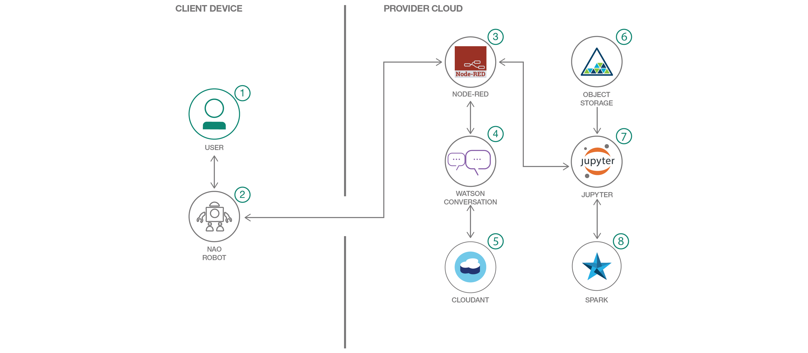

# watson-nao-robot

This journey takes you through end to end flow of steps in building an interactive interface between NAO Robot and Watson Conversation API. Nao Robot listen the vocal query and converts it into text and sends it to Node Red Flow. The Node Red Flow uses Watson Conversation API to break and map the text into intents and entities for which it has been trained already. The conversation API through Node Red Flow further linked to a Jupyter Notebook in Data Science Experience(DSX). In this notebook statistical analysis is performed on the finantial data set. The result of the query is now again sent back to Node Red Flow. Which is transfered to Nao Robo and it speaks the result.

1. The user asks the specific questions to the Robot.
2. Robot will convert the speech into text and it will send the text to Node Red Flow.
3. The Node Red Flow uses the Watson Conversation API for handling the text and web socket for transferring the input and output between Node Red Flow and Jupyter notebook. 
4. The Watson Conversation API takes the text input in the form of natural language and breaks and maps it to intents and entities for which it has been trained for.
5. The context of the conversation is saved to the Cloudant DB so that the Conversation API is able to save the state and track the conversation flow of the user.
6. The financial data is stored in the Object storage.
7. Data is utilized as csv files.
8. The Jupyter notebook processes the data and generates insights.
9. The Jypyter notebook is powered by Spark.
